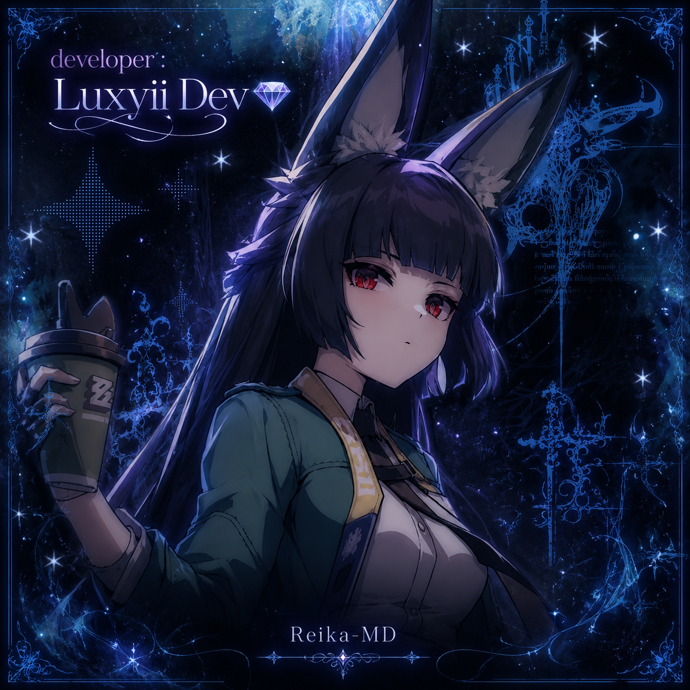

<div align="center">



# ❄️ Reika-MD

### Frost Blade Core • WhatsApp Bot em desenvolvimento


</div>

---

## ⚠️ Aviso importante

A **Reika-MD ainda está em desenvolvimento**.

Esta base pode conter falhas graves, comandos incompletos, sistemas instáveis, erros em eventos do WhatsApp, problemas com LID/PN e mudanças frequentes na estrutura.

Use por sua conta e risco. Não trate esta base como versão final ou 100% estável.

Essa base está desatualizada.

---

## 📌 Status do projeto

| Item | Estado |
|---|---|
| Status geral | Ativo |
| Estabilidade | Experimental |
| Desenvolvimento | Em andamento |
| Uso recomendado | Testes, estudo e evolução |
| Compatibilidade | Termux / Host / VPS |
| API obrigatória | Não |
| Baileys | Sim |
| Botões Native Flow | Sim |

---

## ✨ Sobre

A **Reika-MD** é um bot WhatsApp construído com foco em visual bonito, estrutura expansível, sistemas de grupos, proteções automáticas, stickers, jogos, menus com botões e funcionamento em Termux.

A base não depende de uma API fixa obrigatória. O usuário pode configurar sua própria API depois.

---

## 🧩 Recursos atuais

### 🔌 Conexão

- QR Code pequeno no terminal
- QR salvo em PNG
- Código pareado
- Reconexão automática
- AntiCrash básico
- Logs no terminal
- Registro de mensagens recebidas
- Registro de mensagens lidas

### 🎛️ Menus

- Menu principal com botões Native Flow
- Botão de lista
- Botão de criador
- Submenus separados
- Fallback em texto

### 👥 Grupo

- Abrir grupo
- Fechar grupo
- Banir
- Promover
- Rebaixar
- Marcar membros
- Reconhecimento de dono, admin, bot-admin e membros

### ❄️ Bem-vindo

- Bem-vindo por evento real
- Bem-vindo com imagem
- Bem-vindo sem imagem com `bemvindo2`
- Legenda individual por grupo
- Foto de bem-vindo individual por grupo
- Variáveis na legenda

### 🛡️ Proteções

- AntiLink
- AntiLinkGP
- AntiPagamento
- AntiStatus
- AntiFake por DDI +55
- AntiPV3 global
- Proteções com flags por grupo

### 🎴 Stickers

- Criar figurinha
- Criar sticker de imagem
- Criar sticker de vídeo curto
- Corte quadrado limpo
- Sem borda preta
- Rename de sticker
- Pack e author personalizados

### 🎮 Jogos e brincadeiras

- Modo brincadeira por grupo
- Tapa
- Chute
- Abraço
- Cafuné
- Beijo
- Jogo da velha

### ⏰ Operação por horário

- Fechar grupo automaticamente
- Abrir grupo automaticamente
- Horários individuais por grupo
- Code de 2 dígitos para remover horário

---

## 📁 Estrutura principal

```txt
Reika-MD/
├── main.js
├── index.js
├── package.json
├── README.md
├── LICENSE
├── dono/
│   ├── config.json
│   ├── necessary.json
│   └── apis.example.json
├── src/
│   └── midias/
│       └── fotobot.png
├── dados/
│   └── src/
│       ├── funcs/
│       ├── sistemas/
│       ├── menus/
│       ├── infos/
│       ├── sticker/
│       ├── games/
│       ├── tictactoe/
│       ├── Operacao/
│       ├── Welcome/
│       └── json/
└── session/
```

---

## 📦 Instalação no Termux

```bash
pkg update -y && pkg upgrade -y
pkg install -y nodejs git ffmpeg python make clang
git clone https://github.com/luxyiidev-280/Reika-MD.git
cd Reika-MD
npm install
npm start
```

---

## ▶️ Iniciar

```bash
npm start
```

---

## 🔄 Resetar sessão

```bash
npm run reset
```

---

## 🧹 Reinstalar dependências

```bash
npm run clean
```

---

## ⚙️ Configuração principal

Edite:

```txt
dono/config.json
```

Exemplo:

```json
{
  "NomeDoBot": "Reika-MD",
  "Core": "Frost Blade Core",
  "prefixo": "!",
  "NumeroDoDono": ["5511999999999"],
  "ownerLids": [],
  "NickDono": "Luxyii",
  "footer": "Reika-MD • Frost Blade Core",
  "criadorUrl": "https://wa.me/5511999999999",
  "menuImage": "./dados/midias/menu/menu.jpg",
  "noProfileImage": "./dados/midias/menu/sem_foto.jpg"
}
```

---

## 🔐 APIs

A base não deve vir com key real.

Use:

```txt
dono/apis.example.json
```

Crie seu arquivo privado:

```txt
dono/apis.json
```

Esse arquivo está no `.gitignore` e não deve ser publicado.

---

## 🧊 Comandos principais

| Comando | Função |
|---|---|
| `!menu` | Abre menu com botões |
| `!menu2` | Menu geral |
| `!menumemb` | Menu membros |
| `!menuadm` | Menu admin |
| `!menudono` | Menu dono |
| `!menufig` | Menu stickers |
| `!info` | Infos do bot |
| `!ping` | Testa latência |
| `!perfil` | Mostra perfil |
| `!dono` | Mostra criador |

---

## 🛡️ Comandos admin

| Comando | Função |
|---|---|
| `!abrir` | Abre grupo |
| `!fechar` | Fecha grupo |
| `!ban @user` | Remove usuário |
| `!promover @user` | Promove usuário |
| `!rebaixar @user` | Rebaixa usuário |
| `!marcar` | Marca membros |
| `!modos` | Mostra proteções ativas |

---

## ❄️ Bem-vindo

Ativar com imagem:

```txt
!bemvindo 1
```

Desativar:

```txt
!bemvindo 0
```

Ativar modo rápido sem imagem:

```txt
!bemvindo2 1
```

Legenda individual por grupo:

```txt
!legendabv Bem-vindo $user ao grupo $grupo
```

Ver legenda:

```txt
!legendabv status
```

Resetar legenda:

```txt
!legendabv reset
```

Variáveis:

| Variável | Resultado |
|---|---|
| `$user` | usuário marcado |
| `$grupo` | nome do grupo |
| `$membros` | total de membros |
| `$bot` | nome do bot |
| `$footer` | rodapé |
| `$data` | data atual |
| `$hora` | hora atual |
| `$prefixo` | prefixo |

Também aceita `{user}` e `${user}`.

---

## 🖼️ Foto BV individual por grupo

Salvar imagem:

```txt
!fotobv
```

Ver status:

```txt
!fotobv status
```

Resetar:

```txt
!fotobv reset
```

A imagem fica salva por grupo em:

```txt
dados/src/Welcome/fotobv/
```

---

## 🛡️ Proteções

AntiLink:

```txt
!antilink 1
!antilink 0
!antilink hard
```

AntiLinkGP:

```txt
!antilinkgp 1
!antilinkgp 0
```

AntiPagamento:

```txt
!antipagamento 1
!antipagamento 0
```

AntiStatus:

```txt
!antistatus 1
!antistatus 0
```

AntiFake:

```txt
!antifake 1
!antifake 0
```

AntiPV3 global:

```txt
!antipv3 1
!antipv3 0
!antipv3 status
```

---

## 🎴 Stickers

Criar figurinha:

```txt
!s
!sticker
!fig
```

Renomear figurinha:

```txt
!rename
```

Personalizado:

```txt
!rename Meu Pack | Meu Author
```

---

## 🎮 Brincadeiras

Ativar:

```txt
!modobrincadeira 1
```

Comandos:

```txt
!tapa @user
!chute @user
!abraço @user
!cafune @user
!beijo @user
```

---

## 🎲 Jogo da velha

Iniciar:

```txt
!jogodavelha @user
```

Jogar:

```txt
!jv 1
!jv 5
!jv 9
```

Ver tabuleiro:

```txt
!jv status
```

Desistir:

```txt
!desistirvelha
```

---

## ⏰ Horários automáticos

Fechar grupo diariamente:

```txt
!fechargp diario 00:00
```

Abrir grupo diariamente:

```txt
!abrirgp diario 06:00
```

Listar:

```txt
!horarios
```

Apagar:

```txt
!delhorario 28
```

---

## 📚 Infos internas

```txt
!info
!info menu
!info legendabv
!info bemvindo
!info antifake
!info antilink
!info horarios
!info sticker
!info rename
!info modobrincadeira
```

---

## 🧪 Desenvolvimento

A Reika-MD está em fase experimental. Sistemas podem ser refeitos, removidos, quebrados, melhorados ou reorganizados.

Relate bugs com prints, logs e explicação do comando usado.

---

## 👑 Créditos

Desenvolvimento:

```txt
Luxyii Dev
```

---

## 📄 Licença

Este projeto usa licença MIT.

Consulte:

```txt
LICENSE
```
